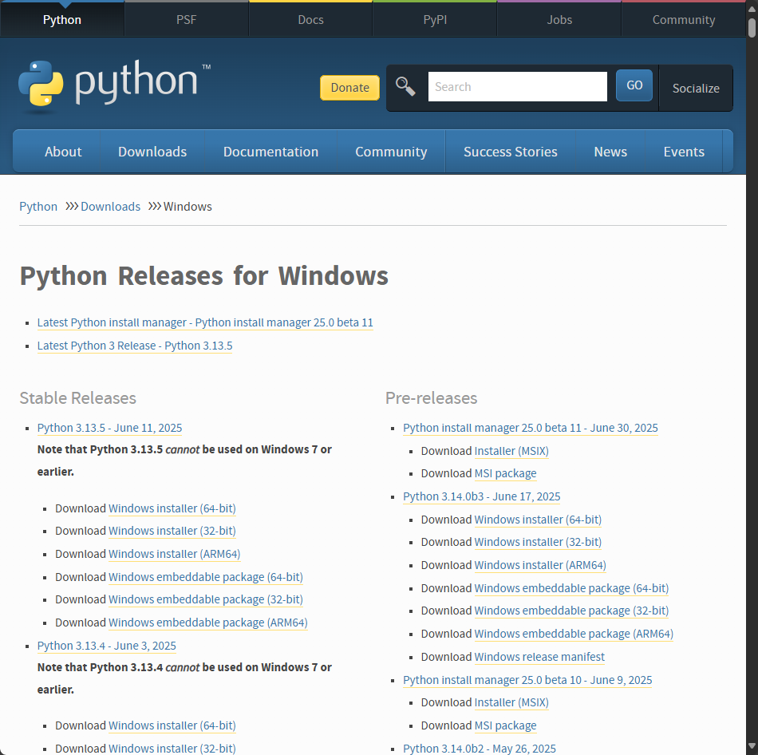

<font size=6>Arrange your documents properly</font>

<font size=5>How to find the answer</font>

google, Stack Overflow, AI, CSDN


<font size=5>Install Python and vscode</font>

(Link: 
https://phoenixnap.com/kb/how-to-install-python-3-windows
https://blog.csdn.net/msdcp/article/details/127033151)

you’ll need to check whether a Python is installed on your computer; if it isn’t, you’ll install it.

(Recommendation: We need a stable version of Python.)





<font size=5>Chapter 2: Variables and Simple Data Types</font>

In Python, a Variable has three main attributes:
1. Name (Identifier)
2. Type (Determined by the Object)
3. Value

```python
message = "Hello Python world!" # Name is message. "" means string Type. Value is Hello Python world!
```

You can add a point behind the Variable to do something
```python
name = "ada lovelace"
print(name.title())
```

{} means Variable
```python
first_name = "ada"
last_name = "lovelace"
full_name = f"{first_name} {last_name}"
```

<font size=5>Option: Install git bash and push files to github</font>

(Link: https://blog.csdn.net/qq_36667170/article/details/79085301
